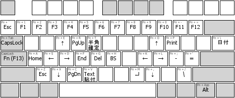
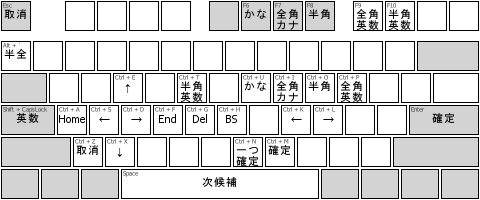

# ahk-f13-layer

## 概要

`[F13]` キーを押している間、他のキー配置を入れ替える AutoHotKey スクリプトの例。
英語配列キーボードで、Scancode Map で `[CapsLock]` を `[F13]` キーに割り当てての使用を想定しています。

Scancode Map なしに、`[CapsLock]` に対して同様の処理を行うスクリプトも同梱しています。
こちらでは、`[Ctrl]` `[Alt]` `[Shift]` 修飾キーとの組み合わせはうまく動きません。Windows カーネル内で `[Shift]+[CapsLock]` が `[英数]` など別のキーとみなされるためです。

## レイアウト

IMEのショートカットを参考にレイアウトしました。 

本レイアウト \

参考: Google 日本語入力 MS-IME キー設定 \

## 特徴

* 右手小指の届きにくいキーの多くを、タッチタイプしやすい場所に移動している
* 簡単なカーソル移動をホームポジションのまま行える
  * WASD, ESDF, HJKL などほかの割り当てもあり
* `[F13]+[Pause]` でスクリプトを一時停止
* `[F13]` を短くタップしたときに `[CapsLock]` `[英数]` キーを押されたことにするオプションあり
  * 誤爆すると戻すのにひと手間かかるため、標準はオフにしています
* マクロ3つを割り当て
  * `[F13]+[T]`: 誤って IME on で入力をはじめたときに、英字に戻して確定し、IME off にする
  * `[F13]+[\]`: 2021-04-01 のような日付をワンキーで入力する
    * Excel の `[Ctrl]+[;]` 相当
  * `[F13]+[V]`: クリップボードをテキスト形式に入れなおして貼り付ける
    * アプリによっては `[Ctrl]+[Shift]+[V]` でテキスト貼り付けできますが、できないもの用に

## 使用前の準備

* [AutoHotkey](https://www.autohotkey.com/) をインストール
* `[CapsLock]` を `[F13]` キーに割り当てる
  * 同梱の ScanCode_CapsLockF13.reg を実行して、PC を再起動
  * または Change Key などのアプリを使用

## 使用方法

f13-layer.ahk ファイルをエクスプローラーでダブルクリックして開始します。

タスクバー右の通知領域にある AutoHotKey アイコンから、一時停止・終了できます。

## 公開ページ

* [hossy3/ahk\-f13\-layer: F13, CapsLock キーを押している間、他のキー配置を入れ替える AutoHotKey スクリプト例](https://github.com/hossy3/ahk-f13-layer)
* 紹介ページ (2021-04-01 公開予定)
